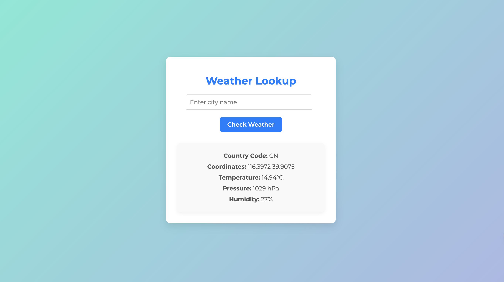

# Weather Lookup

A Django web application that allows users to check the current weather for a specific city using the OpenWeatherMap API.

## Features

- Input a city name to retrieve weather information.
- Displays the country code, coordinates, temperature, pressure, and humidity.
- Responsive design for mobile and desktop users.

## Tech Stack

- **Backend:** Django
- **Frontend:** HTML, CSS
- **API:** OpenWeatherMap API
- **Environment Management:** Python dotenv

## Usage
- Navigate to the application in your web browser.
- Enter a city name in the input field and click "Check Weather".
- The weather information will be displayed below the form.

## Screenshots

## Website
You can view the this website by clicking the link below:

[Click here to view the website](https://weather-lookup-production.up.railway.app/)